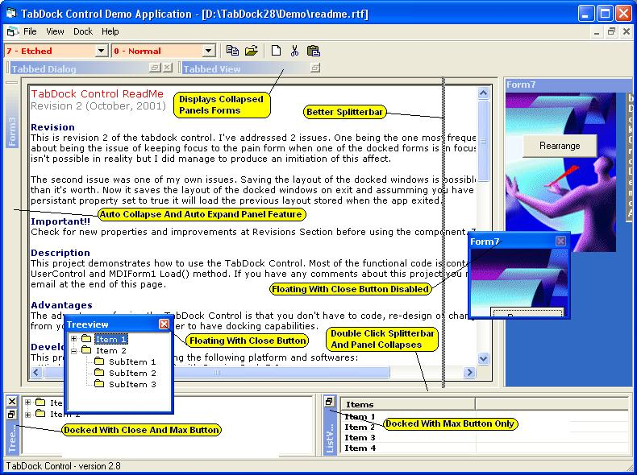



## TabDock 3\.1

### Description

08/05/2003 - Updated

changed VSNET collapsed drawing style.

Some Minor Bug Fixes

06/05/2003 - Updated.

Implemented PanelSizing And PanelDockedForm Sizing Property.

30/04/2003 - Updated.

Implemented New Captions Style VB.Net

28/04/03 - Updated.

Procedure: DockChange - this allows docked forms to be moved from one panel to another through code.

Property: SmartSizing - Reduces panel flicker when sizing and looks much better.

Plus Many Bug Fixes. Check The Revisions.rtf.

25/04/03 - Further Bug Fix. Collapsed Panel Captions and Panel Visible property.

Update: The Focus Problem When The TabDock App Pops To The Front When It Doesn't Have The Focus, Has Now Been Fixed.

Thanks To Neal Rushforth For Sorting This Bug.

Version Updated To 3.0.1

Here It Is.

TabDock 3.0

Neal And My Self Didn't Give This To Ackbar Because Ackbar Has Not Uploaded The Last Update From Neal As Yet!

So Neal And I Have Decided To Upload It Seperatley.

Some Major Changes Have Been Made:

-Updated Splitter Bar

-New Properties : HasClose Button And HasMaxButton

-Disabling Of Close Button When Floating

-Max Button Disables When There’s Only One Form In The Panel

-Bug Fixed – Caption Bar Styles

-Flickering When You Activate A Panel Is Now Sorted

-AutoExpand property added

-AutoCollapseLeft, AutoCollapseRight, AutoCollapseTop, AutoCollapseBottom

- AutoShowCaptionOnCollapse

See The Revisions.rtf For Complete History!

Hope You Like It!

If You Like It Don't Forget To Vote.

Comments Welcome!

Credit Must Be Given To Ackbar For Version 2.4.

Without It, This Version Would Not Be Available.
 
### More Info
 

             |
---                |---
**Submitted On**   |2003-05-07 20:08:36
**By**             |[NR/GN](https://github.com/Planet-Source-Code/PSCIndex/blob/master/ByAuthor/nr-gn.md)
**Level**          |Advanced
**User Rating**    |4.8 (320 globes from 66 users)
**Compatibility**  |VB 5\.0, VB 6\.0
**Category**       |[Custom Controls/ Forms/  Menus](https://github.com/Planet-Source-Code/PSCIndex/blob/master/ByCategory/custom-controls-forms-menus__1-4.md)
**World**          |[Visual Basic](https://github.com/Planet-Source-Code/PSCIndex/blob/master/ByWorld/visual-basic.md)
**Archive File**   |[TabDock\_3\_158493582003\.zip](https://github.com/Planet-Source-Code/nr-gn-tabdock-3-1__1-44755/archive/master.zip)

